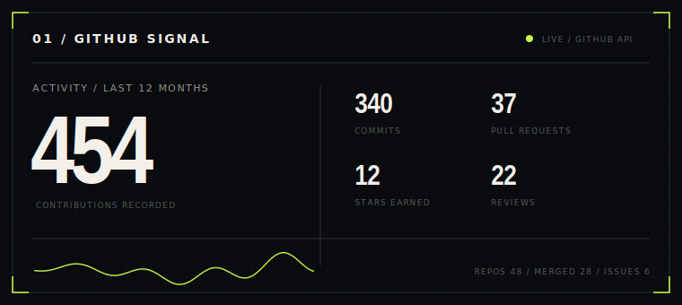
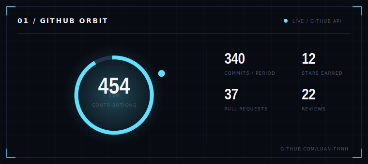
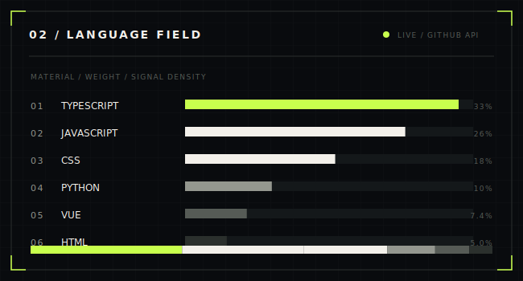
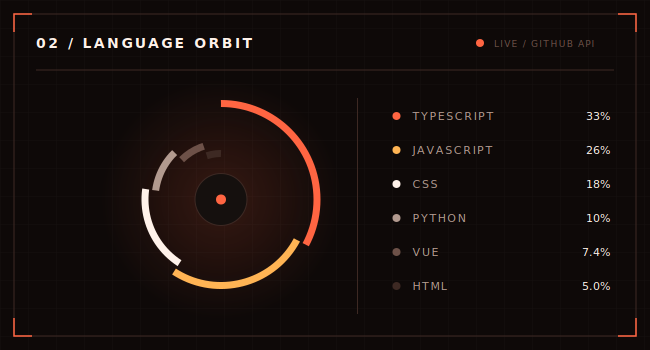
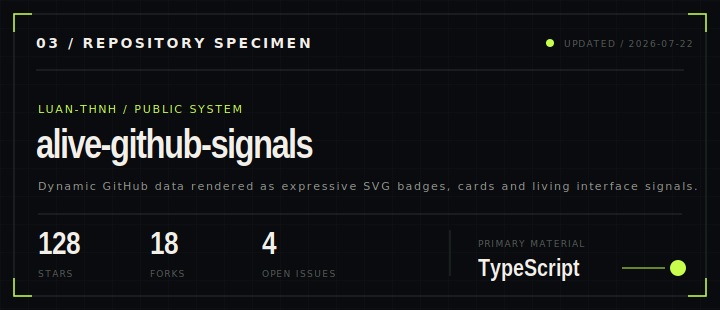
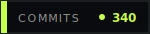
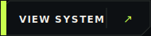

<div align="center">
  
  <h1>Alive GitHub Signals</h1>
  <p><strong>Dynamic GitHub badges, buttons and statistics cards as an editorial living interface.</strong></p>
  <p>
    <a href="#api-endpoints">API</a> ·
    <a href="#query-parameters">Parameters</a> ·
    <a href="docs/DEPLOY.md">Deploy</a> ·
    <a href="docs/THEMES.md">Themes</a>
  </p>
</div>



## What this is

Alive GitHub Signals is a Vercel-ready SVG generation service. Deploy the
repository once, pass a GitHub username through a URL, and embed the returned
artwork anywhere an image is accepted.

```md

```

It follows the same useful URL-driven model as GitHub statistics services, but
uses an original **Alive Interface** art direction:

- editorial and Swiss-inspired layout
- hard geometry instead of generic rounded SaaS cards
- living grids, waveforms, orbital systems and technical annotations
- five coordinated theme presets plus custom colors
- multiple compositions rather than one card with different data
- SVG-native optional animation

The renderer and API implementation are original. The project is conceptually
inspired by the dynamic README ecosystem, including GitHub Stats Extended.

## Highlights

- **11 endpoints:** stats, languages, repo, streak, activity, profile, full
  signal, terminal, badge, button and status.
- **Current GitHub data:** GraphQL profile, repository, contribution, language
  and streak information.
- **URL customization:** themes, custom colors, dimensions, titles, animation,
  language exclusions and cache control.
- **Compatibility aliases:** `/api`, `/api/top-langs`, `/api/pin`,
  `/api/calendar`.
- **Token rotation:** add `GITHUB_TOKEN_2`, `GITHUB_TOKEN_3`, and so on.
- **No database:** deploy directly to Vercel.
- **Builder UI:** visual endpoint configurator with live URL, Markdown and HTML
  output.
- **Safe rendering:** query validation, XML escaping, bounded dimensions and
  server-only credentials.

## Gallery

<table>
  <tr>
    <td></td>
    <td></td>
  </tr>
  <tr>
    <td></td>
    <td></td>
  </tr>
</table>



<div align="center">
  
  
  
</div>

## Quick start

```bash
git clone https://github.com/YOUR_USERNAME/alive-github-signals.git
cd alive-github-signals
npm install
cp .env.example .env.local
npm run dev
```

Set a server-side GitHub token in `.env.local`:

```env
GITHUB_TOKEN=github_pat_xxxxxxxxxxxxxxxxxxxx
NEXT_PUBLIC_SITE_URL=http://localhost:3000
```

Open `http://localhost:3000` for the visual builder.

## Deploy to Vercel

1. Push the source to a GitHub repository.
2. Import the repository in Vercel.
3. Add `GITHUB_TOKEN` in **Settings → Environment Variables**.
4. Deploy.
5. Open `/api/health`, then test `/api/signal?username=YOUR_USERNAME`.

Full deployment instructions: [docs/DEPLOY.md](docs/DEPLOY.md).

## API endpoints

| Endpoint | Output |
|---|---|
| `/api` or `/api/stats` | Editorial or orbital core statistics |
| `/api/languages` | Language field or language orbit |
| `/api/repo` | Repository specimen card |
| `/api/streak` | Current and longest streak |
| `/api/activity` | Contribution calendar trace |
| `/api/profile` | Identity card with optional embedded avatar |
| `/api/signal` | Full Alive Interface system panel |
| `/api/terminal` | Live developer terminal |
| `/api/badge` | Compact static or data-driven badge |
| `/api/button` | README CTA artwork |
| `/api/status` | Availability/status broadcast |

Complete examples: [docs/API.md](docs/API.md).

### Examples

```text
/api/stats?username=luan-thnh&variant=editorial
/api/stats?username=luan-thnh&variant=orbit&theme=cobalt
/api/languages?username=luan-thnh&layout=orbit&langs_count=6
/api/repo?username=luan-thnh&repo=music-player
/api/profile?username=luan-thnh&avatar=true
/api/badge?username=luan-thnh&metric=commits&label=COMMITS
/api/status?label=AVAILABLE+FOR+WORK&state=online
```

## Query parameters

Shared parameters include:

```text
username       GitHub login
repo           Repository name for /api/repo
theme          alive | paper | cobalt | ember | mono
accent         Custom hex color without #
accent2        Secondary hex color
bg             Background color
text           Main text color
muted          Secondary text color
border         Border color
width          SVG width, bounded per request
height         SVG height, bounded per request
title          Accessible custom title
animate        true to enable SVG-native motion
cache_seconds  300–86400, default 21600
period         year | all
exclude_langs  Comma-separated language names
repo_pages     1–5 repository pages for language aggregation
demo           true to use bundled preview data
download       1 to send SVG as an attachment
```

## Dynamic data and caching

On a cache miss, the route handler requests current data from GitHub and renders
an SVG response. The generated image is cached by Vercel's CDN. This gives you
updated cards without forcing every README view to consume GitHub API quota.

The default cache duration is six hours. Use `cache_seconds=300` for faster
updates or a longer duration for public/high-traffic deployments.

`period=all` uses GitHub commit search to estimate all-time authored commits.
The default period is the last twelve months because it is faster and more
consistent with GitHub's contribution data.

## Project structure

```text
app/
  api/[card]/route.ts       Dynamic SVG endpoint dispatcher
  api/health/route.ts       Deployment health check
  page.tsx                  Alive Interface builder website
components/
  Builder.tsx               Query/Markdown/HTML generator
lib/
  github/client.ts          GitHub GraphQL + REST data layer
  render/cards.ts           Original SVG compositions
  render/svg.ts             Shared visual primitives
  themes.ts                 Theme tokens and custom palette resolver
docs/
  API.md
  DEPLOY.md
  THEMES.md
scripts/
  render-previews.ts
```

## Development checks

```bash
npm run preview:generate
npm run typecheck
npm test
npm run build
```

## Security

- Never prefix the GitHub token with `NEXT_PUBLIC_`.
- Tokens are selected only inside server route handlers.
- Query text is bounded and XML-escaped before rendering.
- Width, height and cache duration are clamped.
- Use minimum token permissions and rotate leaked credentials immediately.

## License

MIT © luanthnh
